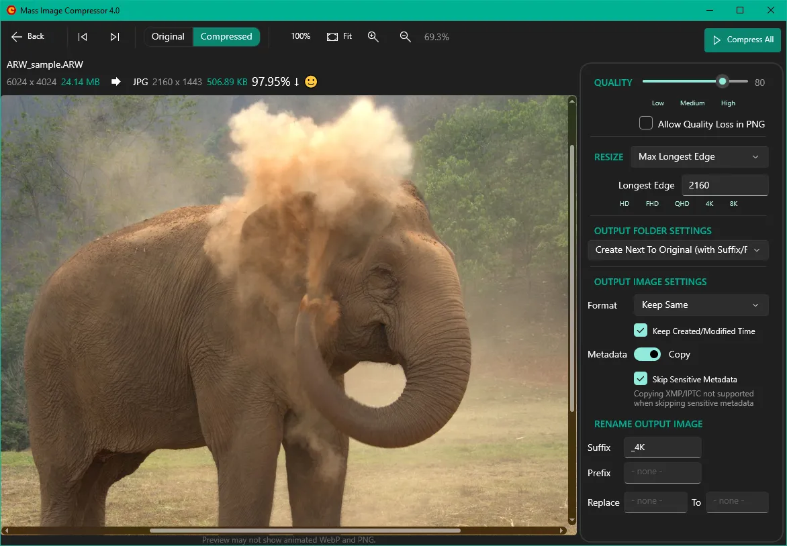
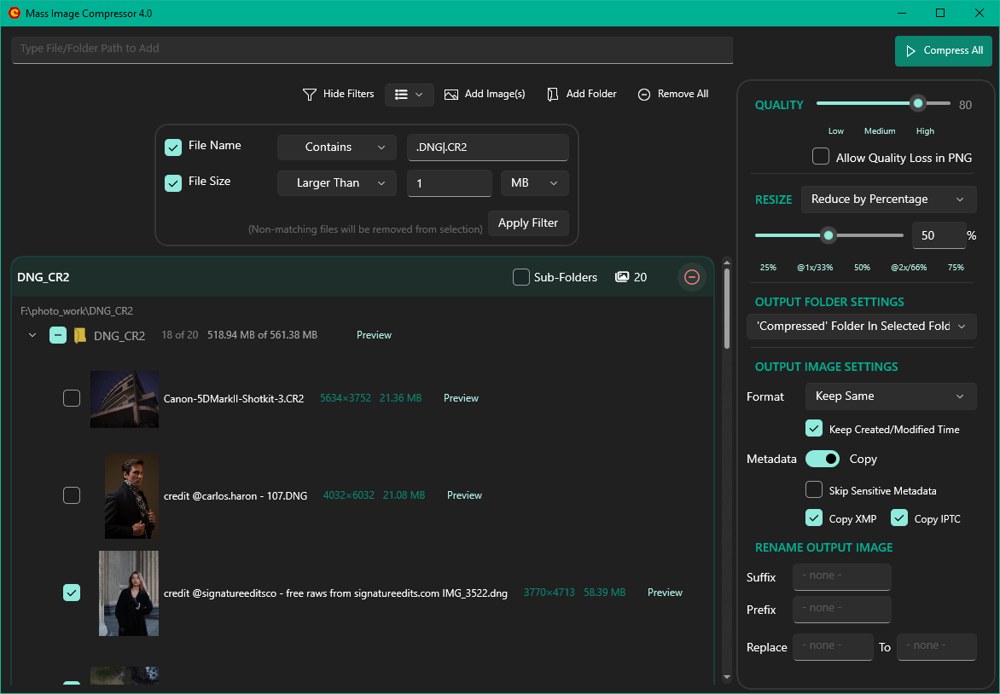
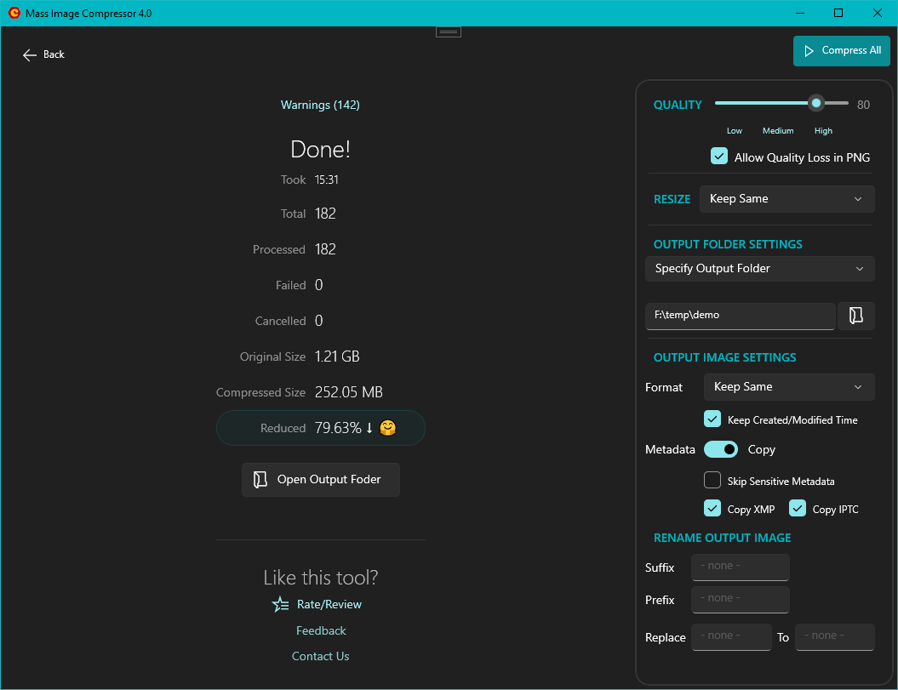
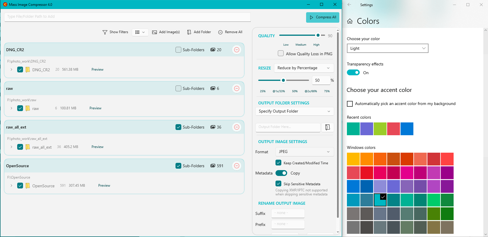

<div>
  <a href="https://mic.cognirush.com/windows/">
    
  </a>
  <a href="https://sourceforge.net/projects/icompress/">
    
  </a>
</div>

# Mass Image Compressor

Mass Image Compressor is a fast, lightweight batch image processing tool that compresses, resizes, and converts images to popular formats like WebP, AVIF, JPEG, PNG, and GIF—reducing file size while preserving quality.
This official source code of modern version of Mass Image Compressor hosted at [SourceForge](https://sourceforge.net/projects/icompress/), redesigned with a modern WinUI 3 interface and built on .NET 8 for Windows 10 and 11 in year 2025. 

---

## 📥 Download

### Windows 10 and above, Windows Server 2019 and above
Use one of these methods to install Mass Image Compressor.

#### Option 1: SourceForge.net
Download latest unsigned installer from [SourceForge.net](https://sourceforge.net/projects/icompress/) (free). As the installer is unsigned and releases first, Windows security may kick-in and may have to take additional steps to install this. Choose other options if you are not comfortable. 

#### Option 2: Github or Winget 
You can download the installer from this Github project (see [releases](https://github.com/Cognirush-Labs-LLP/icompress-win/releases)) or use below script to install via winget. 
```bash
winget source update
winget install --id=Cognirush.MassImageCompressor -e
```
More details [here](https://mic.cognirush.com/install-via-winget/)

#### Option 3: Use Microsoft Store
Get signed installer from [Microsoft Store](https://apps.microsoft.com/detail/9NF6R54S63L3?launch=true&mode=full?cid=git) (one-time cost of a coffee). You get auto-update feature and Windows security is cool with it as the installer is signed.

<a href="https://apps.microsoft.com/detail/9NF6R54S63L3?launch=true&mode=full?cid=git">
	
</a>

### Using older Windows System? 
If you are on Windows 7, 8.x, you will need to use [older version (3.3.x)](https://sf.net/projects/icompress/files/icompress/Mass%20Image%20Compressor/MassImageCompressorV3.3.3.msi/download) of Mass Image Compressor which is shared on [SourceForge.net](https://sourceforge.net/projects/icompress/).

### macOS 13+
Mass Image Compressor for macOS is written in Swift by us but it is closed source at present. You can download it from [Mac App Store](https://apps.apple.com/app/apple-store/id6670366523?pt=127286138&ct=WindowsGit&mt=8). It has all required features freely available and purchase is required only for professional features (like watermark or some advanced features).

***NOTE**: Mass Image Compressor is **NOT** available on Android, iOS, iPadOS or as a web application.* 

---

## 🔧 Features

- Compress multiple folders and files in one go (including optional subfolders)
- Seamless Windows Explorer integration via the "Send To" menu
- Advanced metadata copy settings (EXIF, XMP, IPTC) with filtering (e.g., strip GPS, serial numbers)
- Full support for **Animated Images** (GIF, PNG, WebP)
- Output to modern formats like **WebP** and **AVIF**
- Regex filters for filenames and size-based exclusions
- Suffix/Prefix options and filename text replacement for output files
- Powerful Preview UI with pixel-level image comparison (`CTRL + T`)
- Robust and faster **RAW image support**
- Multiple flexible output destination modes:
  - Replace original files
  - Output to specific folder
  - Store next to original with suffix/prefix
  - Inside a `Compressed` subfolder
- Flexible resizing:
  - By percentage
  - Long edge, fixed width/height
  - Frame-based for print or responsive image sets (1x/2x/3x)

---
## 🖼️ Screenshots

<div style="display: flex; flex-wrap: wrap; gap: 10px;">
  <a href="screenshots/4K_Preview.webp">
    
  </a>
 
  <a href="screenshots/Gallery.PNG">
    
  </a>
   <a href="screenshots/CompressionOutput.PNG">
    
  </a>
  <a href="screenshots/ThemeFit.PNG">
    
  </a>
</div>

---
## 📦 Built With & Credits

This project makes use of the following libraries and tools:

- [Magick.NET](https://github.com/dlemstra/Magick.NET) - Image conversion & manipulation, this is a .NET port of [ImageMagick](https://github.com/ImageMagick/ImageMagick)
- [ExifTool](https://exiftool.org) - Metadata reading and writing
- [APNG Optimizer](https://sourceforge.net/projects/apng/files/APNG_Optimizer/) - Optimization for animated PNGs
- [FFmpeg](https://ffmpeg.org) - Underlying video and animation encoding/decoding via Magick.NET
- [OxiPNG](https://github.com/shssoichiro/oxipng) - PNG compression
- [Serilog](https://github.com/serilog/serilog) - Flexible logging infrastructure
- [Gifsicle](https://www.lcdf.org/gifsicle/) - Editing and creating GIF images
- [pngquant](https://pngquant.org/) - For compressing PNGs with lesser colors
- [Inno Setup](https://jrsoftware.org/isinfo.php) - For install setup binary

Other tools & credits used during development:
- [Font Awesome](https://fontawesome.com/) - Used free fonts for emojies
- [Signature Edits](https://www.signatureedits.com/) - For RAW image testing and screenshots.
- [Krita](https://krita.org/en/) - Used for graphics editing (screenshots etc.)
- [Paint.NET](https://www.getpaint.net/) - Used for graphics editing 


---


## 👥 Community & Feedback

We're collecting feedback during this rewrite phase. Join the discussion or report issues to help stabilize the new generation of Mass Image Compressor. If you have a functional feedback, provide it [here](https://mic.cognirush.com/mass-image-compressor-for-windows/).

---
## 💖 Support Development

If you find this project helpful, consider supporting its development. Test, Report Bugs, or just share it with friends!

Please read [LICENSE](./LICENSE) and [NOTICE.txt](./NOTICE.txt). If you're sharing a custom build, just make sure to remove the Cognirush Labs support email or contact links, otherwise folks might email/contact me about something I didn't build, and I won't be able to help (or worse, give them the wrong advice). Appreciate the understanding!

Also, your donation helps keep the project active and maintained.  
[☕ Donate via PayPal](https://www.paypal.com/paypalme/Yogendrasinh)

or, purchase from [Microsoft Store](https://apps.microsoft.com/detail/9NF6R54S63L3?launch=true&mode=full?cid=git) to make contribution and get automatic updates.

---
Have a great image compression today! 
